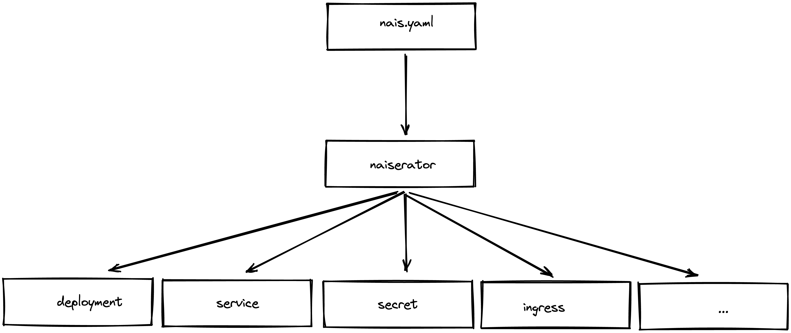

# Introduction to NAIS

### It is NAIS - Yes, but what is it?

NAIS is an application platform built to increase development speed by providing our developers at NAV with the best possible tools to develop and run their applications.

At the core of NAIS lies [Kubernetes](https://kubernetes.io), which is a Swiss army knife of tools, and each of these tools comes with its own set of instructions in the form of [YAML](https://en.wikipedia.org/wiki/YAML). This means that YAML can be written for more functionality than you could possibly shake a stick at, and we don't want to burden our developers with having to deal with all this yaml. So putting it as simply as one possibly can.. The essential components of kubernetes have been compressed into a single [nais.yaml](/nais-application/example/) file that in turn generates all the underlying Kubernetes resources.

When you have a large development organisation, providing the developers with turn-key solutions for their most common needs is essential in terms of limiting cognitive load and letting them get on with their core objectives.

The services included are \(but not limited to\) [logging](observability/logs/), [metrics](observability/metrics.md), [alerts](observability/alerts/), [deployment](deployment/), [operators](/basics/operators/) and a runtime environment (across [on-prem](clusters/on-premises.md) and [GCP](clusters/gcp.md)).

Within each of these aspects, we leverage open source projects best suited for our needs and provide them with usable abstractions, sane defaults and the required security hardening.

In addition NAIS has a client component [naisdevice](device/README.md) that facilitates access in a secure, enlightening and empowering way.

### A brief history of everything NAIS.

In spite of this ambition to simplify all the things it has so far been beyond our capabilites to compress the documentation into something "digestive". So depending on your state of mind, being, comepetence or interest feel free to jump to wherevever you like through the navigation or join us "from the top" for a brief synopsis of the why, the what, from whence and all the rest of it. That way we will attempt to segway into the nuts and bolts - and from there you can move onto you first NAIS application.

[Getting started](basics/access.md) section will get you up to speed.